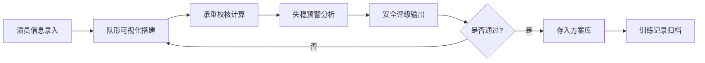

## 1. 产品概述
杂技叠罗汉受力安全人塔承重与失稳预警生产力系统，面向专业杂技团训练场景，为演员人塔搭建提供受力分析、安全评估、失稳预警的全流程数字化工具。

- 核心目标：通过科学的力学计算降低杂技训练中的安全风险，建立标准化的人塔安全评估体系
- 目标用户：杂技团教练、安全督导、演员及训练管理人员

## 2. 核心功能

### 2.1 用户角色
| 角色 | 描述 | 核心权限 |
|------|------|----------|
| 教练/管理员 | 系统主要使用者，负责训练规划 | 完整功能使用、方案管理、数据导出 |
| 演员 | 查看个人信息与受力数据 | 查看个人数据、确认训练方案 |

### 2.2 功能模块
1. **演员录入页**：演员基础信息录入与管理，包括体重、身高、承重能力等关键参数
2. **队形搭建页**：可视化金字塔队形搭建，拖拽式演员位置编排
3. **承重校核页**：逐层荷载传递计算，底座受压安全校验，支撑点受力对称性分析
4. **失稳预警页**：整体重心计算、支撑多边形校验、冲击荷载模拟、风险分级告警
5. **方案库页**：已验证安全队形方案存档、训练历史记录查询与复用

### 2.3 页面详情
| 页面名称 | 模块名称 | 功能描述 |
|----------|----------|----------|
| 演员录入页 | 演员列表 | 展示已录入演员信息，支持搜索与筛选 |
| 演员录入页 | 新增/编辑演员 | 录入姓名、编号、性别、年龄、身高(cm)、体重(kg)、最大承重(kg)、肩宽、备注 |
| 演员录入页 | 演员档案 | 查看演员参与历史训练记录与承重统计 |
| 队形搭建页 | 队形画布 | 可视化金字塔网格画布，支持多层堆叠布局 |
| 队形搭建页 | 演员分配 | 从演员库拖拽演员到指定位置，显示位置编号 |
| 队形搭建页 | 队形参数 | 设置层间距、底座宽度、动作难度等级 |
| 承重校核页 | 荷载传递计算 | 逐层向下计算累计荷载，显示每个支撑点受力值 |
| 承重校核页 | 安全阈值校验 | 对比实际受力与演员承重上限，超限位置高亮标红 |
| 承重校核页 | 对称受力分析 | 左右支撑点受力差值计算，单侧过载预警 |
| 失稳预警页 | 重心计算 | 基于体重与位置计算人塔整体重心坐标 |
| 失稳预警页 | 支撑多边形校验 | 判断重心是否落在底座支撑区域内 |
| 失稳预警页 | 冲击荷载模拟 | 模拟晃动、脱手等异常情况的瞬时冲击力 |
| 失稳预警页 | 风险分级告警 | 头重脚轻、重心偏移等风险的三级告警系统 |
| 失稳预警页 | 安全评级 | 按动作难度与受力状态给出A/B/C/D四级安全评级 |
| 方案库页 | 方案列表 | 已保存的安全队形方案卡片展示 |
| 方案库页 | 方案详情 | 查看方案完整队形、受力数据、评级信息 |
| 方案库页 | 训练档案 | 每次训练的队形、承重数据、告警记录存档 |
| 方案库页 | 方案导入导出 | JSON格式方案数据导入导出 |

## 3. 核心流程
用户录入演员信息 → 在队形画布上搭建金字塔人塔 → 系统自动计算荷载传递与重心位置 → 承重校核超限标红、失稳预警分级告警 → 给出安全评级 → 验证通过后存入方案库 → 训练时调用方案并记录档案

## 4. 用户界面设计
### 4.1 设计风格
- **主色调**：深邃海军蓝 (#0F1B2D) 为主背景，警示红 (#E63946)、安全绿 (#2A9D8F)、警戒橙 (#F4A261) 作为状态指示色，金色 (#E9C46A) 作为点缀
- **按钮风格**：圆角 8px，微渐变填充，悬停时轻微上浮 + 发光效果
- **字体**：标题使用 "Playfair Display" 衬线体增强专业感，正文使用 "Noto Sans SC" 易读性优化
- **布局风格**：左右分栏导航 + 卡片式内容区，数据密集区采用仪表盘式布局
- **视觉元素**：工程感网格背景、微妙的结构线条装饰、状态指示灯动效

### 4.2 页面设计概览
| 页面名称 | 模块名称 | UI元素 |
|----------|----------|--------|
| 演员录入页 | 演员列表 | 卡片式列表，头像+关键指标悬浮展示，添加按钮浮动右下角 |
| 队形搭建页 | 队形画布 | 深灰网格背景，位置槽用虚线框，选中态金色发光，演员卡片可拖拽 |
| 承重校核页 | 荷载展示 | 人塔侧视图，每个节点显示受力值/承重上限/百分比环，超限红色脉冲 |
| 失稳预警页 | 重心视图 | 俯视投影图，支撑多边形描边，重心点动态发光，偏移时闪烁告警 |
| 方案库页 | 方案卡片 | 缩略预览图 + 评级徽章 + 保存时间，悬停展开详情 |

### 4.3 响应式设计
- 桌面端优先 (1440px+)，采用双栏或三栏仪表盘布局
- 平板端 (768-1440px) 折叠侧边栏为图标模式
- 移动端 (<768px) 单列堆叠，核心数据优先展示
- 触控区域最小 44×44px，拖拽操作支持触摸手势

### 4.4 交互动效
- 页面切换采用淡入 + 轻微滑动过渡
- 超限告警采用红色脉冲呼吸灯效果
- 重心偏移时支撑多边形边缘抖动提示
- 数据加载采用骨架屏 + 渐显动画
- 拖拽演员时位置槽高亮预占位
