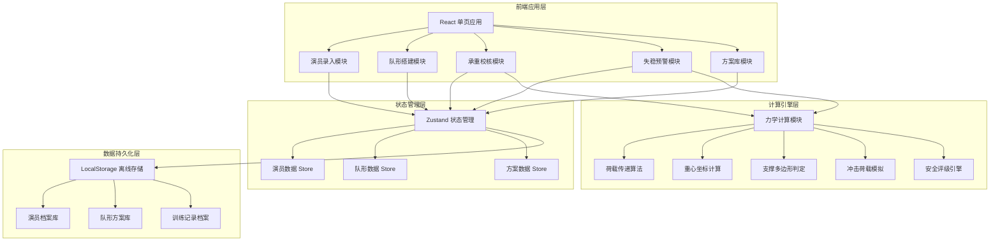
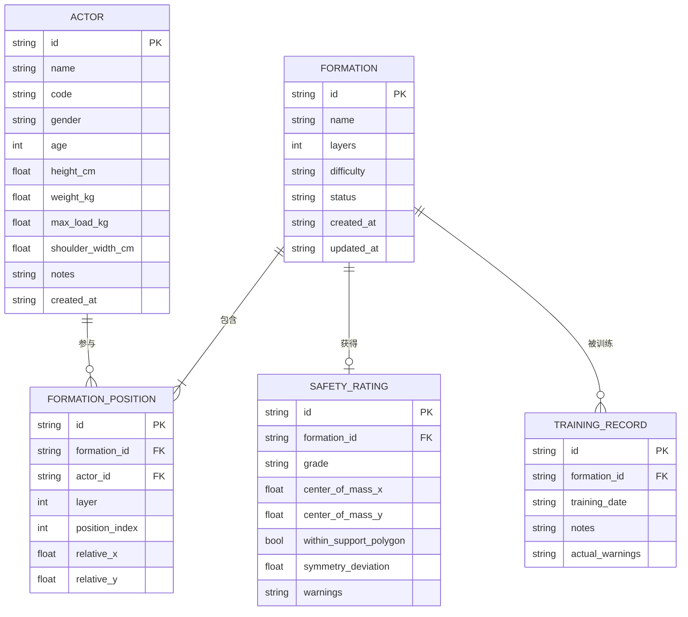

## 1. 架构设计



## 2. 技术选型说明
- **前端框架**：React@18 + TypeScript，类型安全保障复杂计算逻辑
- **构建工具**：Vite@5，快速冷启动与热更新
- **样式方案**：TailwindCSS@3 + CSS变量，高效实现设计系统
- **状态管理**：Zustand，轻量级且支持持久化中间件
- **路由**：React Router v6，单页多视图导航
- **图标**：Lucide React，统一风格的工程感图标
- **数据存储**：LocalStorage + Zustand Persist，纯前端离线可用
- **可视化**：原生 SVG + CSS 动画实现人塔视图与重心投影

## 3. 路由定义
| 路由路径 | 页面名称 | 说明 |
|----------|----------|------|
| /actors | 演员录入页 | 演员信息的增删改查 |
| /formation | 队形搭建页 | 可视化金字塔队形编排 |
| /load-check | 承重校核页 | 荷载传递计算与安全校验 |
| /stability | 失稳预警页 | 重心分析与失稳风险告警 |
| /library | 方案库页 | 已验证方案存档与训练档案 |
| / | 重定向到 /actors | 首页默认跳转 |

## 4. 数据模型

### 4.1 数据实体关系图



### 4.2 核心类型定义

```typescript
// 演员实体
interface Actor {
  id: string;
  name: string;
  code: string;
  gender: 'male' | 'female';
  age: number;
  heightCm: number;
  weightKg: number;
  maxLoadKg: number;
  shoulderWidthCm: number;
  notes?: string;
  createdAt: string;
}

// 队形位置
interface Position {
  id: string;
  layer: number;        // 层号，从下往上 0,1,2...
  index: number;        // 该层内的位置索引
  actorId?: string;     // 分配的演员ID
  relativeX: number;    // 相对X坐标 (-1~1)
}

// 队形方案
interface Formation {
  id: string;
  name: string;
  layers: number;
  difficulty: 'easy' | 'normal' | 'hard' | 'extreme';
  positions: Position[];
  createdAt: string;
  updatedAt: string;
}

// 受力计算结果
interface LoadResult {
  positionId: string;
  selfWeight: number;       // 自身体重 kg
  cumulativeLoad: number;   // 累计承受荷载 kg
  maxCapacity: number;      // 承重上限 kg
  loadRatio: number;        // 荷载比 (0~1+)
  isOverloaded: boolean;
}

// 重心分析结果
interface StabilityResult {
  centerX: number;          // 重心X坐标
  centerY: number;          // 重心Y坐标
  totalWeight: number;      // 总重量
  isWithinPolygon: boolean; // 重心是否在支撑多边形内
  polygonArea: number;      // 支撑多边形面积
  deviationDistance: number;// 重心偏移距离
  topHeavyRatio: number;    // 头重脚轻比率
  symmetryScore: number;    // 对称度评分 0~100
}

// 安全评级
interface SafetyRating {
  grade: 'A' | 'B' | 'C' | 'D';
  score: number;
  warnings: WarningItem[];
}

// 告警项
interface WarningItem {
  level: 'info' | 'warning' | 'danger';
  type: 'overload' | 'eccentric' | 'top_heavy' | 'symmetry' | 'impact';
  message: string;
  positionId?: string;
}

// 训练记录
interface TrainingRecord {
  id: string;
  formationId: string;
  formationSnapshot: Formation;
  trainingDate: string;
  durationMinutes?: number;
  actualWarnings: WarningItem[];
  notes?: string;
}
```

## 5. 核心算法

### 5.1 荷载传递计算
- 金字塔形人塔：每层每个节点的荷载平均分配给下一层相邻的两个支撑节点
- 递推公式：`Load[i][j] = Weight[i][j] + (Load[i-1][j-1] + Load[i-1][j]) / 2`
- 边界位置只受一个上层节点传递的荷载

### 5.2 重心坐标计算
- 加权平均：`Xc = Σ(Wi * Xi) / ΣWi`，`Yc = Σ(Wi * Yi) / ΣWi`
- 每层高度根据演员身高自动估算

### 5.3 支撑多边形判定
- 底座演员位置构成凸多边形顶点
- 使用射线法判断重心点是否在多边形内部
- 计算重心到各边距离评估安全裕度

### 5.4 冲击荷载模拟
- 晃动系数：1.2~1.5倍静态荷载
- 脱手冲击：被支撑演员体重 × 自由落体放大系数 (1.8~2.5)
- 瞬时荷载持续时间 0.1~0.3 秒

### 5.5 安全评级模型
- A级 (安全)：荷载比 < 70%，对称度 > 90%，重心在多边形内且裕度充足
- B级 (合格)：荷载比 < 85%，对称度 > 75%，重心在多边形内
- C级 (警告)：荷载比 < 100%，对称度 > 60%，或存在轻微偏移
- D级 (危险)：任一超限或重心越界
